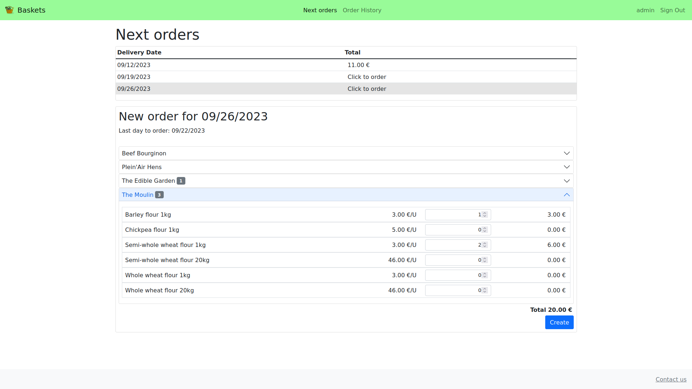

# Baskets

A website to manage orders for local food baskets.

Project built using Django, Bootstrap and JavaScript.



## Table of contents

1. [Background and goal](#background)
2. [Features](#features)
3. [Dependencies](#dependencies)
4. [Run using Docker](#run)
5. [Populate dummy database](#dummy-db)
6. [Configure SMTP](#smtp)
7. [Tests run](#tests-run)
8. [API Reference](#api-ref)
9. [UI Language](#language)

## Background and goal <a name="background"></a> 

This project has been developed to meet a real need for a local association.

The aforementioned association centralises orders for several local food producers.
Thus, food baskets are delivered regularly to users.

Before the deployment of this application, administrators got orders from users via SMS or email.

`Baskets` app aims to save them time by gathering user orders in one unique tool.

Payments are managed outside this application.

## Features <a name="features"></a> 

### User interface

- **Login** page: Not logged users will be redirected to "Login" page. Where they can log in using their email and password.
- **Register** page: Users can create an account by entering their personal information and setting a password.
  - Passwords are validated to prevent weak passwords.
  - A verification email is sent to user. Only users with verified email can log in.
- **Next Orders** page: shows the list of deliveries for which we can still order, in chronological order.
  - Clicking on each delivery opens a frame below showing delivery details: date when baskets will be delivered, last day to order and available products arranged by producer.
  - User can create one order per delivery.
  - Orders can be updated or deleted until their deadline.
- **Order history** page: shows a list of user's closed orders in reverse chronological order. Clicking on each order will open its details below.
- **Password reset**:
  - In "Login" page, a link allows users to request password reset entering their email address. 
  - If an account exists for that email address, an email is sent with a link to a page allowing to set a new password.
- **Profile** page: clicking on username loads a page where user can view and update its profile information.
- **Contact us** page: a link on page footer loads a page with a contact form. The message will be sent to all staff members.

All functionalities except "contact" requires authentication.

### Admin interface

- **Users** page allows activating/deactivating user accounts and setting user groups.
- **Groups** page allows sending an email to all users in each group via a link.
- **Producers** page allows to: 
  - Manage producers and its products (name and unit price).
  - Export .xlsx file containing recap of monthly quantities ordered for each product (one sheet per producer)
  - If a product is deleted or its unit price changes, related opened orders will be updated and a message will be shown to email affected users.
  - Whole producer or single products can be **deactivated**, so it won't be available for deliveries. Also, related opened orders will be removed and a message will be shown to email affected users.
- **Deliveries** page allows to:
  - Set each delivery date, order deadline and available products.
    - If "order deadline" is left blank, it will be set to `ORDER_DEADLINE_DAYS_BEFORE` before delivery date.
  - View **total ordered quantity** for each product to notify producers. A link allows to see all related Order Items.
  - In "Deliveries list" page:
    - View "orders count", which links to related orders.
    - **Export related order forms**: Once a delivery deadline is passed, a link will be shown to download delivery order forms in *xlsx* format. The file will contain one sheet per order including user information and order items.
    - Email users having ordered for selected deliveries.
  - If a product is removed from an opened delivery, related opened orders will be updated and a message will be shown to email affected users.
- **Orders** page allows to:
  - View and update user orders.
  - In "Orders list" page: 
    - Export .xlsx file containing recap of monthly order amounts per user.
    - If one or several orders are deleted, a message will be shown to email affected users.

### Other

- **Mobile-responsiveness**: This has been achieved using Bootstrap framework for user interface. Moreover, Django admin interface is also mobile responsive.
- **API**: User orders can be managed using an API. See [API reference](#api-ref) for further details.
- **UI Translation**: *Translation strings* have been used for all UI text to facilitate translation. See [UI Language](#language) for further details.

## Dependencies <a name="dependencies"></a>

In addition to **Django**, the following libraries has been used:

- **Django-allauth**: to manage user login, register and password reset
- **Django-REST-Framework**: to build the API
- **XlsxWriter**: to create xlsx files in `baskets/export.py`
- **OpenPyxl**: to test file exports in `baskets/tests/test_exports.py`
- **Selenium**: to do browser end-to-end testing in `baskets/tests/test_functional.py`

Required versions can be seen in [requirements](requirements) (pip) or [Pipfile](Pipfile) (pipenv).

## Run using Docker <a name="run"></a>
 
    $ git clone https://github.com/daniel-ob/baskets.git
    $ cd baskets

Then run:

    $ docker compose up -d

And finally, create a superuser (for admin interface):

    $ docker compose exec web python manage.py createsuperuser

- User interface: [http://127.0.0.1:8000/](http://127.0.0.1:8000/)
- Admin interface: [http://127.0.0.1:8000/admin](http://127.0.0.1:8000/admin)

Please note that, for simplicity, `console` email backend is used by default for email sending, so emails will be written to `stdout`.

## Populate dummy database <a name="dummy-db"></a>

    docker exec baskets-web sh -c "python manage.py shell < populate_dummy_db.py"

## Configure SMTP <a name="smtp"></a>

- Change backend on `config/settings.py`:

```
EMAIL_BACKEND = "django.core.mail.backends.smtp.EmailBackend"
```

- Set SMTP server config on `.envs/.local/.web`:

```
# SMTP server config (if used)
EMAIL_HOST=
EMAIL_HOST_PASSWORD=
EMAIL_HOST_USER=
EMAIL_PORT=
EMAIL_USE_TLS=
```

## Tests run <a name="tests-run"></a>

Be sure you have ChromeDriver installed in order to run Selenium tests. 

First launch `db` container:

    $ docker compose up -d db

Then open virtual environment and install all dependencies:

    $ pipenv shell
    (baskets)$ pipenv install --dev

Finally, run all tests:

    (baskets)$ python manage.py test

To run only functional tests:

    (baskets)$ python manage.py test baskets.tests.test_functional

## API Reference <a name="api-ref"></a>

A Postman collection to test the API can be found [here](baskets_API.postman_collection.json).

### Browsable API

If settings.DEBUG is set to True, browsable API provided by REST framework can be visited on [http://127.0.0.1:8000/api/v1/](http://127.0.0.1:8000/api/v1/)

### API Authentication

All API endpoints requires token authentication.

JWT token pair can be requested on `/api/token/` providing `username` and `password` (request Body form-data). 
This returns `access` and `refresh` tokens.

To authenticate requests, `access` token must be added to headers:

    Authorization: Bearer {{access_token}}

When expired, `access` token can be refreshed on `/api/token/refresh/` providing `refresh` token.

### List open deliveries

List deliveries for which we can still order.

```
GET /api/v1/deliveries/
```

**Response**

```
 Status: 200 OK
```
```
[
    {
        "url": "http://127.0.0.1:8000/api/v1/deliveries/3/",
        "date": "2023-06-27",
        "order_deadline": "2023-06-23"
    },
    {
        "url": "http://127.0.0.1:8000/api/v1/deliveries/2/",
        "date": "2023-07-04",
        "order_deadline": "2023-06-30"
    }
```

### Get delivery detail

```
GET /api/v1/deliveries/{delivery_id}/
```

**Response**

```
 Status: 200 OK
```
```
{
    "id": 2,
    "date": "2023-05-30",
    "order_deadline": "2023-05-25",
    "products_by_producer": [
        {
            "name": "producer1",
            "products": [
                {
                    "id": 1,
                    "name": "Eggs (6 units)",
                    "unit_price": "2.00"
                },
            ]
        },
        {
            "name": "producer2",
            "products": [
                {
                    "id": 2,
                    "name": "Big vegetables basket",
                    "unit_price": "1.15"
                }
            ]
        }
    ],
    "message": "This week meat producer is on vacation",
}
```

### List user orders

```
GET /api/v1/orders/
```

**Response**

```
 Status: 200 OK
```
```
[
    {
        "url": "http://127.0.0.1:8000/api/v1/orders/30/",
        "delivery": {
            "url": "http://127.0.0.1:8000/api/v1/deliveries/2/",
            "date": "2023-07-04",
            "order_deadline": "2023-06-30"
        },
        "amount": "220.00",
        "is_open": true
    }
]
```

### Get order detail

```
GET /api/v1/orders/{order_id}/
```

**Response**

```
 Status: 200 OK
```
```
{
    "url": "http://127.0.0.1:8000/api/v1/orders/30/",
    "delivery": 2,
    "items": [
        {
            "product": 5,
            "product_name": "Package of meat (5kg)",
            "product_unit_price": "110.00",
            "quantity": 2,
            "amount": "220.00"
        }
    ],
    "amount": "220.00",
    "message": "",
    "is_open": true
}
```

### Create an order

```
POST /api/v1/orders/
```
```
{   
    "delivery": 3,
    "items": [
        {
            "product": 14,
            "quantity": 2
        }
    ],
    "message": "is it possible to come and pick it up the next day?"

}
```

Request must follow this rules:

- delivery must be opened for orders (`delivery.is_open == true`)
- a user can only post an order per delivery
- order must contain at least one item
- all item products must be available in `delivery.products`
- all item quantities must be greater than zero

**Response**
```
Status: 201 Created
```
```
(Created order detail)
```

### Update an order

Orders can be updated until `delivery.order_deadline`.

```
PUT /api/v1/orders/{order_id}/
```
```
{   
    "delivery": 3,
    "items": [
        {
            "product": 14,
            "quantity": 1
        }
    ]
}
```

Updated items must follow this rules:

- all item products must be available in `delivery.products`
- all item quantities must be greater than zero

**Response**

```
 Status: 200 OK
```
```
(Updated order detail)
```

### Delete an order

```
DELETE /api/v1/orders/{order_id}/
```

**Response**

```
 Status: 204 No Content
```

## UI Language <a name="language"></a>

*Translation strings* has been used for all text of user and admin interfaces, 
so all of them can be extracted into messages files (`.po`) to facilitate translation.

In addition to default language (English), French translation is available and can be set on `settings.py`:    
  
    LANGUAGE_CODE = "fr"

Server must be restarted to apply changes.

### Adding new translations 

From base directory, run:

    django-admin makemessages -l LANG
    django-admin makemessages -d djangojs -l LANG

Where `LANG` can be, for example: es, es_AR, de ...

This will generate `django.po` and `djangojs.mo` translation files inside `locale/LANG/LC_MESSAGES` folder.

Once all `msgstr` in `.po` files are translated, run:

    django-admin compilemessages

This will generate corresponding `.mo` files.
